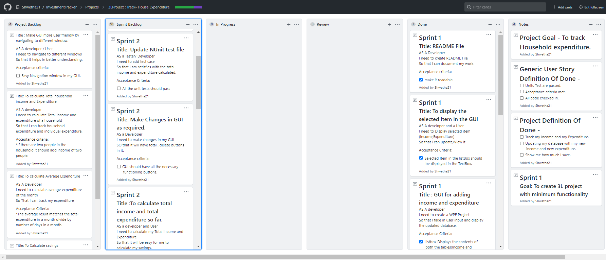
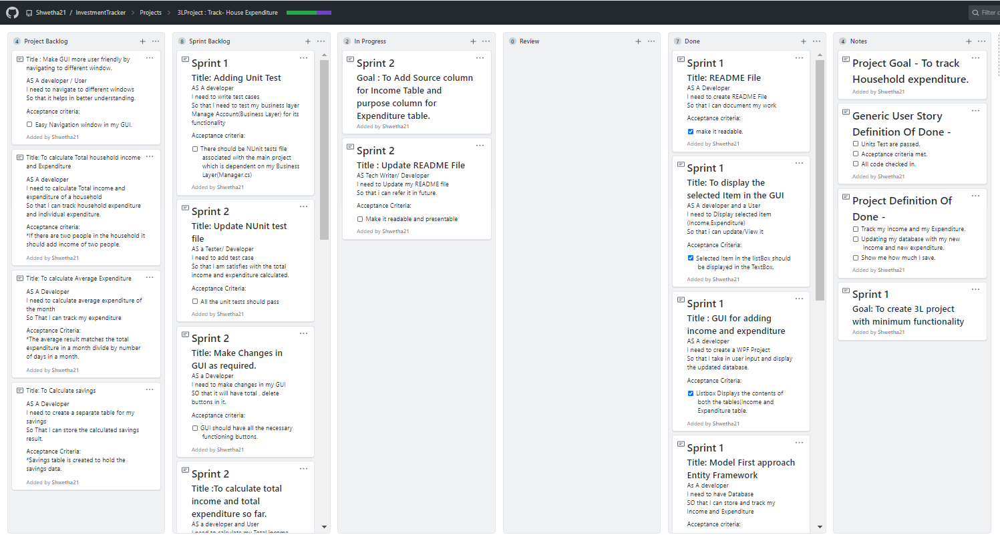
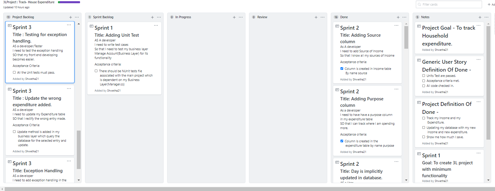
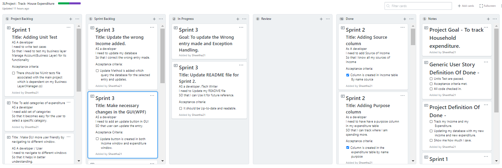

# Investment Tracker

The 3 layer project helps you to store your income and expenditure and can be viewed anytime we want.

## Project Goal
*To Track household expenditure 

## Definition Of Done
- [ ] Track my Income and my Expenditure.
- [ ] Updating my database with my new income and new expenditure.
- [ ] Show me how much I save.

### Sprint 1
#### Goal: To create 3Layer project with minimum functionality
* Create a database using Model first entity framework approach.
* To create a business layer to act as inteface between database and GUI.
* To create a WPF project to add a GUI layer.

#### Screenshot of project Board Before and after Sprint 1

##### Before Sprint 1
 

##### After Sprint 1

#### Output Sprint 1 Review

* List Of Sprint Backlog items that were completed: 
    * Console App created to start the Project.
    * Investment class and expenditure class Added.
    * Class Library created to add the business layer.
    * Model first approach Entity framework used to create the database.
    * GUI layer created to get inputs from the user to add to database.
    * Method is added in business layer to populate the selected item in GUI.
    * README File created and updated as and when necessary.

* List of Sprint Backlog items that could not be completed.
    * Writing testcase to test the data addition to the database. 

* Suggestions to add categories of Expenditure Ex: Seperate category for Groceries, for  EMI etc.

#### Sprint 1 Retrospective
* Things that went well:
    * Planning and doing things ahead of time.
    * Project board was very helpful in planning and organising.
    * Simple to Complex approach in adding functionality to the application is helping in moving one step at a time.
    

* Things to Improve:
    * Commit to GitHub for each user story. 

### Sprint 2
#### Goal: To Add Source column for Income Table and purpose column for Expenditure table.
* To add Source column in Income Table and Purpose of expenditure in Expenditure table.
* To add delete option in GUI.
* To calculate Total Income and Total expenditure. 
* To claculate the balance.

#### Screenshot of project Board Before and after Sprint 2

##### Before Sprint 2

##### After Sprint 2

#### Output of Sprint 2 Review

* List Of Sprint Backlog items that were completed: 
    * Adding Source column in Income table and purpose column in my expenditure Table.
    * Day of adding entry to the database is implicitly added.
    * To calculate the Total Income and Total expenditure so far.
    * Updating README File.
    * Adding Unit Tests to Test whether the Total Income , Total Expenditure and balance calculated are correct.
    * To delete the wrong entry made to the table.
    * Making changes to the GUI so that it handles all the new methods added in my business layer.

* Could Complete All the tasks planned for Sprint2.

* Suggestions made format date, add functionality to calculate monthly expenditure. Which were previouly included in the project backlog.

#### Sprint 2 Retrospective
* Things that went well:
    * Could Demo the project with most of CRUD functionality.
    * As before, planning ahead helped in finishing the decided task on time.

* Things to Improve:
    * Due to last minute changes in the code resulted in a bug while demo. Avoid it or make sure you evrything is working before demo.

### Sprint 3
#### Goal: To add functionality to update the wrong entry made and handle exceptions.
* To add update method in my business layer.
* Make sure GUI doesnt take in any invalid data.
* Handle Exceptions.

#### Screenshot of project Board Before and after Sprint 2

##### Before Sprint 3

