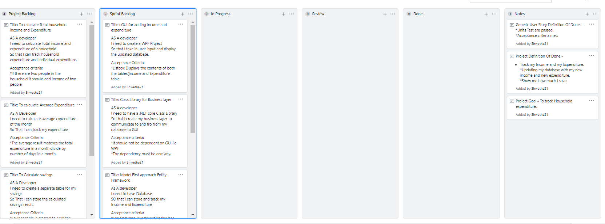

# Investment Tracker

The 3 layer project helps you to store your income and expenditure and can be viewed anytime we want.

## Project Goal
*To Track household expenditure 

## Definition Of Done
- [ ] Track my Income and my Expenditure.
- [ ] Updating my database with my new income and new expenditure.
- [ ] Show me how much I save.

### Sprint 1
#### Goal: To create 3Layer project with minimum functionality
* Create a database using Model first entity framework approach.
* To create a business layer to act as inteface between database and GUI.
* To create a WPF project to add a GUI layer.

### Screenshot of project Board Before and after Sprint 1

##### Before Sprint 1
 

### Outcome of Sprint Review

